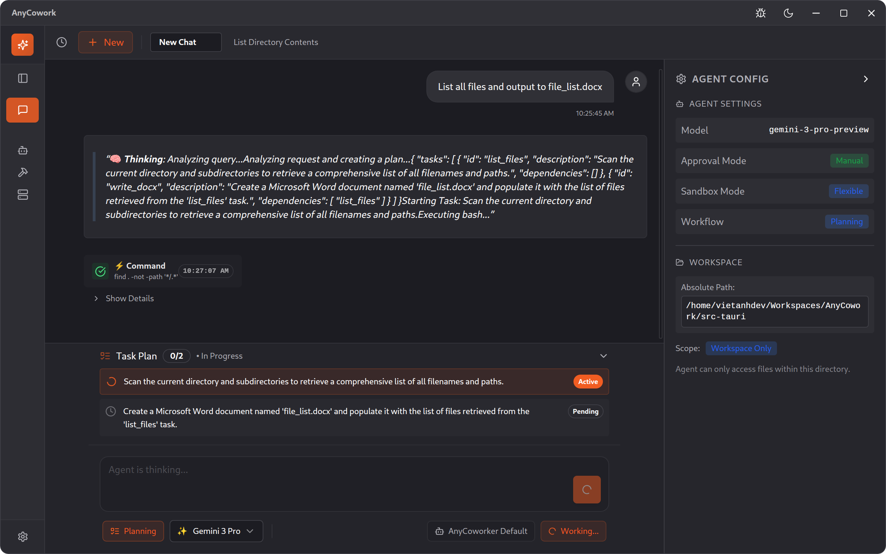

# AnyCowork: The Smart, Safe, & Optimized AI Coworker



**AnyCowork** is an open-source, **local-first** AI coworker that lives on your desktop. Built with **Tauri and Rust** for performance, it uses **Coordinator-Worker** agents to help you accomplish complex tasks safely and efficiently.

## Core Pillars

- 🧠 **Smart**: Powered by **Gemini 3 Pro** (and other SOTA models), extensible via **MCP** (Model Context Protocol), and customizable with Skills.
- 🛡️ **Safe**: **Safety by Design**. Granular permissions, human-in-the-loop confirmation for sensitive actions, and strict guardrails.
- ⚡ **Optimized**: **Rust + Tauri** means ~7MB binary size (.deb), minimal RAM usage, and instant performance. No Electron bloat.

## Quick Start

### Prerequisites

- [Rust](https://rustup.rs/) (1.77.2+)
- [Node.js](https://nodejs.org/) (18+)
- At least one AI API key (OpenAI GPT)

### 1. Install Dependencies

```bash
# Install dependencies
npm install

# (Optional) Install website dependencies
cd website
npm install
cd ..
```

### 2. Configure Environment

Create a `.env` file in the project root:

```bash
cp .env.example .env
# Edit .env and add your OpenAI API key
```

Or manually create `.env`:
```bash
OPENAI_API_KEY=your_openai_key_here
```

### 3. Run the Desktop App

```bash
# From the project root, run the Tauri app (this starts both frontend and backend)
npm run tauri dev
```

This will:
- Build the Rust backend
- Start the Vite dev server for the frontend
- Open the desktop application window

**First run may take several minutes** to download and compile Rust dependencies.

### 4. (Optional) Run the Documentation Website

```bash
cd website
npm run dev
```

Open http://localhost:3000 to view the documentation site.

## Development

### Run in Development Mode

```bash
# 1. Install dependencies (first time only)
npm install

# 2. Set up environment
cp .env.example .env
# Edit .env and add: OPENAI_API_KEY=your_key_here

# 3. Run the app with hot-reload
npm run tauri dev
```

This starts:
- **Vite dev server** for frontend (hot-reload on file changes)
- **Rust backend** with debug symbols
- **Desktop window** with DevTools access (press `Ctrl+Shift+I`)

**First run takes several minutes** to compile Rust dependencies. Subsequent runs are fast.

### Development Commands

| Command | Description |
|---------|-------------|
| `npm run tauri dev` | Run app with hot-reload |
| `npm run dev` | Frontend only (http://localhost:5173) |
| `cd src-tauri && cargo build` | Build Rust backend only |
| `cd src-tauri && cargo test` | Run Rust tests |
| `cd src-tauri && cargo fmt` | Format Rust code |
| `cd src-tauri && cargo clippy` | Lint Rust code |
| `npm run lint` | Lint frontend code |

## Production

### Build for Production

```bash
npm run tauri build
```

### Build Outputs

Built executables are in `src-tauri/target/release/bundle/`:

| Platform | Formats | Location |
|----------|---------|----------|
| **Linux** | `.deb`, `.AppImage` | `bundle/deb/`, `bundle/appimage/` |
| **macOS** | `.app`, `.dmg` | `bundle/macos/`, `bundle/dmg/` |
| **Windows** | `.exe`, `.msi` | `bundle/nsis/`, `bundle/msi/` |

### Run Production Build

```bash
# Linux (AppImage)
./src-tauri/target/release/bundle/appimage/anycowork_0.1.0_amd64.AppImage

# Linux (after installing .deb)
anycowork

# macOS
open src-tauri/target/release/bundle/macos/AnyCowork.app

# Windows
src-tauri\target\release\bundle\nsis\AnyCowork_0.1.0_x64-setup.exe
```

See [docs/build.md](docs/build.md) for advanced build options (cross-compilation, CI/CD, code signing).

## Project Structure

```
anycowork/
├── src/                      # React + Vite frontend source
│   ├── routes/              # Page components
│   ├── components/          # UI components
│   └── lib/                 # API client, hooks
├── components/               # Shared components
├── hooks/                    # React hooks
├── package.json
│
├── src-tauri/               # Rust backend (Tauri)
│   ├── src/
│   │   ├── lib.rs           # Main app logic, Tauri commands
│   │   ├── main.rs          # Entry point
│   │   ├── agents.rs        # AI agent system
│   │   ├── telegram.rs      # Telegram bot integration
│   │   ├── database.rs      # SQLite database
│   │   ├── models.rs        # Data models
│   │   ├── schema.rs        # Diesel schema
│   │   └── events.rs        # Event types
│   ├── migrations/          # Database migrations
│   ├── Cargo.toml
│   └── tauri.conf.json
│
└── docs/                    # Documentation
```

## Why AnyCowork?

### 🧠 Smart & Agentic
- **Coordinator-Worker Architecture**: A "Planner" breaks down goals, and "Workers" execute them.
- **MCP Native**: Connect to GitHub, Postgres, Local Files, and more using standard [MCP Servers](https://modelcontextprotocol.io).
- **Proactive Skills**: Teach your agent new workflows by adding `SKILL.md` guides.

### 🛡️ Safe & Secure
- **Permission Manager**: You decide what the agent can read or write.
- **Confirmation Loops**: The agent asks before running shell commands or editing critical files.
- **Local Data**: Chat history and vector indices live in `~/.local/share/anycowork`. Your data, your rules.

### ⚡ Optimized for Desktops
- **Native Performance**: Built on Rust. Blazing fast, lightweight, and efficient.
- **Fast Mode**: Instant chat for quick questions, bypassing the heavy planner.
- **Offline First**: Core functionality works without internet (except API calls).

## Technology Stack

- **Backend**: Rust, Tauri 2.0, Diesel ORM, SQLite
- **AI**: OpenAI GPT via rig-core
- **Telegram**: teloxide
- **Frontend**: React 19, Vite, TypeScript, Tailwind CSS
- **UI Components**: shadcn/ui, Radix UI

## Configuration

### Environment Variables

Create a `.env` file:

```bash
# Required: AI API Key
OPENAI_API_KEY=your_openai_key_here

# Optional: Telegram (configured via UI)
# Bot tokens are stored in the database
```

### Tauri Configuration

Edit `src-tauri/tauri.conf.json` to customize:
- Window dimensions and decorations
- App identifier and metadata
- Build settings

## API Commands (Tauri IPC)

### Agent Commands
- `create_agent` - Create a new agent
- `get_agents` - List all agents
- `chat` - Send message to agent

### Telegram Commands
- `create_telegram_config` - Create Telegram bot config
- `get_telegram_configs` - List all configs
- `update_telegram_config` - Update config
- `delete_telegram_config` - Delete config
- `start_telegram_bot` - Start a bot
- `stop_telegram_bot` - Stop a bot
- `get_telegram_bot_status` - Check bot status
- `get_running_telegram_bots` - List running bots

### Approval Workflow
- `approve_action` - Approve pending tool execution
- `reject_action` - Reject pending tool execution

## Database

Migrations are automatically run on startup. To create a new migration:

```bash
cd src-tauri
diesel migration generate migration_name
```

Database location:
- **Linux**: `~/.local/share/com.anycowork.app/anycowork.db`
- **macOS**: `~/Library/Application Support/com.anycowork.app/anycowork.db`
- **Windows**: `%APPDATA%\com.anycowork.app\anycowork.db`

## Troubleshooting

### Common Issues

1. **Build fails with missing icons**
   - Ensure `src-tauri/icons/` contains required icon files
   - Run icon generation or provide placeholder icons

2. **Database errors**
   - Check that migrations have run successfully
   - Delete `anycowork.db` to reset database

3. **Telegram bot not responding**
   - Verify bot token is correct
   - Check that the bot configuration is set to active
   - Ensure the bot is started via the UI

4. **OpenAI API errors**
   - Verify `OPENAI_API_KEY` is set correctly
   - Check API key has sufficient credits

## Contributing

Contributions are welcome! Please:
1. Fork the repository
2. Create a feature branch
3. Make your changes
4. Run tests and linting
5. Submit a pull request

## License

This project is licensed under the MIT License.

## Acknowledgments

- **Tauri** - Desktop app framework
- **teloxide** - Telegram bot framework
- **rig-core** - AI agent framework
- **shadcn/ui** - UI component library

---

**Version**: 0.1.0
**Status**: Development
**Last Updated**: 2026-01-20
