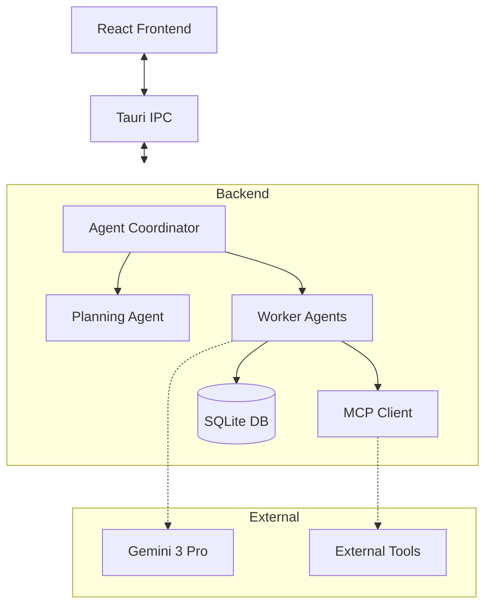

# Architecture

AnyCowork is built on a robust, local-first architecture using **Tauri 2.0** and **Rust**.

## System Overview

The application follows the Tauri architecture, splitting the frontend and backend into two distinct processes that communicate via IPC (Inter-Process Communication).

## Core Components

### 1. Agent Coordinator
The central engine that manages the lifecycle of user requests.
- **Fast Mode**: For simple queries, it streams responses directly.
- **Plan Mode**: For complex tasks, it engages the Planner to break down goals.

### 2. Multi-Agent System
- **Planning Agent**: Decomposes complex user requests into atomic tasks.
- **Worker Agents**: specialized execution environments that can run in parallel (future) or sequence.

### 3. Model Context Protocol (MCP)
The backend acts as an MCP Client, allowing it to connect to any MCP-compliant server. This enables:
- **Universal Tooling**: Connect to Postgres, GitHub, Slack, etc. without custom code.
- **Sandboxing**: Tools run in their own processes.

### 4. Data Layer
All persistent data is stored in a local SQLite database using Diesel ORM.
- **Messages**: Stored with full fidelity (no truncation).
- **Sessions**: Grouped conversations.
- **Vectors**: Local embeddings for semantic search.

## Security Model

AnyCowork implements "Safety by Design":

1. **Permission Manager**: Intercepts every sensitive tool call.
2. **User Confirmation**: Critical actions require explicit approval.
3. **Local Storage**: No data is sent to the cloud except for LLM inference (which is stateless).
