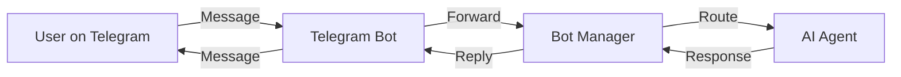

# Connectors & Integrations

Connectors allow AnyCowork agents to communicate through external platforms. Instead of only chatting in the desktop app, your agents can respond to messages on Telegram, and more platforms in the future.

## How Connectors Work



Each connector follows the same pattern:

1. **Receive** - Listen for incoming messages from the external platform
2. **Route** - Forward the message to the assigned AnyCowork agent
3. **Process** - The agent generates a response using its AI model and tools
4. **Reply** - Send the response back through the platform

## Telegram Connector

The Telegram connector is AnyCowork's first and most mature integration. It uses the [teloxide](https://github.com/teloxide/teloxide) framework for async Telegram bot communication.

### Setup

1. Create a bot via [@BotFather](https://t.me/botfather) on Telegram
2. Copy the bot token
3. Open AnyCowork and go to your Agent's settings
4. Under **Platform Configs**, enable Telegram and paste the bot token
5. Save - the bot will start automatically if enabled

### Features

- **Multi-bot support** - Run multiple Telegram bots, each linked to a different agent
- **Chat filtering** - Restrict which Telegram chats the bot responds to using allowed chat IDs
- **Auto-start** - Bots configured as active will start when the app launches
- **Hot reload** - Update bot tokens or switch agents without restarting the app

### Configuration

The Telegram configuration is stored in the `telegram_configs` database table:

| Field | Description |
|-------|-------------|
| `bot_token` | Telegram bot API token from BotFather |
| `agent_id` | The AnyCowork agent that handles messages |
| `is_active` | Whether the bot should be running |
| `allowed_chat_ids` | Comma-separated list of allowed Telegram chat IDs (empty = allow all) |

### Architecture

```
TelegramBotManager
├── start_bot(config_id)    # Spawns a tokio task with teloxide dispatcher
├── stop_bot(config_id)     # Sends shutdown signal via mpsc channel
├── get_status(config_id)   # Checks if bot is in running_bots map
└── running_bots: HashMap<config_id, ShutdownSender>
```

The manager maintains a `HashMap` of running bots keyed by config ID. Each bot runs in its own async task and can be independently started and stopped.

## Future Connectors

The following connectors are planned for future releases:

### Discord
- Bot integration using the Serenity framework
- Channel-specific agent routing
- Slash command support

### Slack
- Slack App with Events API
- Thread-aware conversations
- Workspace-level agent management

### WhatsApp Business
- Via the WhatsApp Business API
- Template message support

### Email (IMAP/SMTP)
- Monitor inbox for messages
- Agent-composed replies

## Building Your Own Connector

See the [Extending AnyCowork](/docs/extending) guide for a step-by-step walkthrough of building a custom connector. The Telegram connector (`src-tauri/src/telegram.rs`) is the reference implementation.
