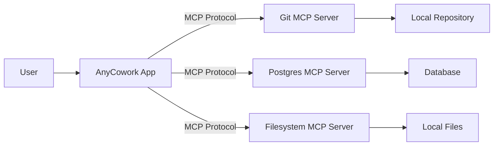

# Model Context Protocol (MCP)

AnyCowork is built on the **Model Context Protocol (MCP)**, an open standard that enables AI assistants to connect to data and tools in a standardized way.

## What is MCP?

[MCP](https://modelcontextprotocol.io) is a protocol that standardizes how AI models interact with external context. Instead of building custom integrations for every database, file system, or API, MCP provides a universal language for these connections.

Think of it like a **USB port for AI applications**. Just as USB let you connect any device to any computer, MCP lets you connect any data source to any AI assistant.

## Why AnyCowork Uses MCP

We chose MCP as the backbone of AnyCowork for three reasons:

1.  **Interoperability**: You can use existing MCP servers from the community (e.g., for PostgreSQL, Google Drive, GitHub) without waiting for us to build an integration.
2.  **Security**: MCP allows for granular permission control. You decide exactly what resources an agent can access.
3.  **Future-Proofing**: As the ecosystem grows, AnyCowork grows with it.

## How It Works in AnyCowork

AnyCowork acts as an **MCP Client**. It can connect to local or remote **MCP Servers**.

### Architecture



### Supported MCP Features

- **Resources**: Agents can read data from external sources (e.g., reading a file, fetching a database row).
- **Tools**: Agents can execute commands (e.g., running a SQL query, committing code).
- **Prompts**: Reusable prompt templates provided by servers.

## Getting Started with MCP

*(Note: MCP implementation is currently in active development. The following features are part of the v0.2.0 roadmap.)*

### connecting a Server

1.  Open **Settings** -> **Integrations**.
2.  Click **Add MCP Server**.
3.  Choose the transport type (Stdio or SSE).
4.  Enter the command to run the server (e.g., `npx -y @modelcontextprotocol/server-postgres`).

### Building Your Own Server

You can build custom MCP servers to expose your internal tools to AnyCowork.

```python
# Example: A simple MCP server in Python
from mcp.server import MultiServer

async def main():
    server = MultiServer("my-tools")
    
    @server.tool("hello")
    async def say_hello(name: str) -> str:
        return f"Hello, {name}!"
        
    await server.serve_stdio()
```

## Recommended MCP Servers

- **[Filesystem](https://github.com/modelcontextprotocol/servers/tree/main/src/filesystem)**: Give agents access to specific local directories.
- **[GitHub](https://github.com/modelcontextprotocol/servers/tree/main/src/github)**: Search code, manage issues, and create pull requests.
- **[PostgreSQL](https://github.com/modelcontextprotocol/servers/tree/main/src/postgres)**: Read and write to your database schemas.
- **[Brave Search](https://github.com/modelcontextprotocol/servers/tree/main/src/brave-search)**: Enable web search capabilities.
